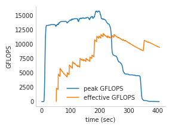
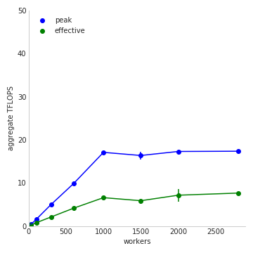

# Benchmarking teraflops with microservices

This is the initial benchmark from our first blog post, and the newer
version that tests scaling from our recent paper. 

* [flops_benchmark.ipynb](flops_benchmark.ipynb) shows an example of testing with a fixed
number of workers
* [flops_scaling.ipynb](flops_scaling.ipynb) varies the number of workers to track scaling. 

