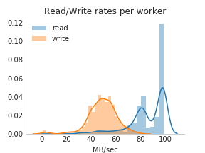
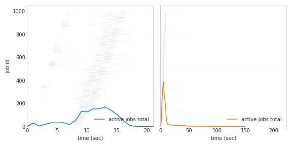
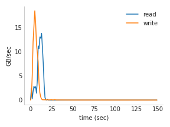

# S3 Benchmarks

These benchmarks measure how fast we can read and write to S3. 

* [s3_benchmark.ipynb](s3_benchmark.ipynb) shows an example of testing with a fixed
number of workers
* [s3_scaling.ipynb](s3_scaling.ipynb) varies the number of workers to track scaling. 

